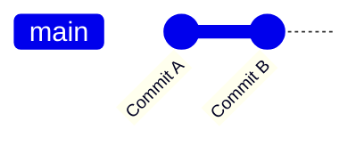
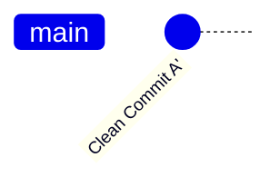

# Git Commit Cleanup — Visual & Training Guide

This document is designed for **training and onboarding**.  
It explains how to clean up Git commit history using **visual diagrams (Mermaid)** and clear, step-by-step explanations.

> Target audience: junior developers, bootcamp students, and teams standardizing Git workflows.

---

## Why Commit History Matters

A clean commit history:
- Makes code reviews easier
- Helps teammates understand *why* changes were made
- Avoids confusion when debugging or reverting changes

In this guide, you will learn **two safe ways** to turn multiple commits into **one clean commit**.

---

## Git Command Comparison

| Command          | What does it do? | Should you use it? |
|------------------|------------------|--------------------|
| `rebase -i`      | Edit, combine, or remove past commits | ✅ Best professional option |
| `reset --soft`   | Removes commits but keeps changes staged | ✅ Simple and beginner-friendly |
| `commit --amend` | Modifies only the last commit | ⚠️ Limited use |
| `revert`         | Creates a new commit that undoes another | ❌ Not for cleanup |

---

## Learning Scenario

You accidentally created **two commits**, but you want **only one**.

### Current State



### Desired State



---

## Option A — Interactive Rebase (`rebase -i`)

### When to Teach This
- Professional environments
- Teams that value clean, intentional history
- Developers comfortable with a text editor

### Step 1: Start the rebase

```bash
git rebase -i HEAD~2
```

### Step 2: Git Opens an Editor

```
pick a1b2c3d Commit A
pick e4f5g6h Commit B
```

### Step 3: Squash the Second Commit

```
pick a1b2c3d Commit A
squash e4f5g6h Commit B
```

### Visual Result


### Key Takeaways
- ✅ Most powerful method
- ✅ Preserves intent
- ⚠️ Requires confidence with Git

---

## Option B — Soft Reset (`reset --soft`)

### When to Teach This
- Beginners
- Visual learners
- Fast local cleanup

### Step 1: Reset History

```bash
git reset --soft HEAD~2
```

### What Happens


> Commits disappear, but **all changes remain staged**.

### Step 2: Create a New Commit

```bash
git commit -m "Clean commit with all changes"
```

### Final Result


### Key Takeaways
- ✅ Easiest to explain
- ✅ No editor involved
- ❌ Original messages are lost

---

## Decision Guide (For Students)

| Your Goal | Recommended Command |
|---------|---------------------|
| Learn professional Git workflows | `rebase -i` |
| Fix mistakes quickly | `reset --soft` |
| Working with pushed/shared commits | ❌ Do not rewrite history |

---

## Training Rule of Thumb

> **Only rewrite history if commits are local.**  
> If commits are already pushed to GitHub or GitLab, coordinate with your team first.

---

## Exercises (Optional)

1. Create two dummy commits
2. Clean them using `rebase -i`
3. Repeat using `reset --soft`
4. Compare the results with `git log --oneline`

---

Happy learning 🚀
