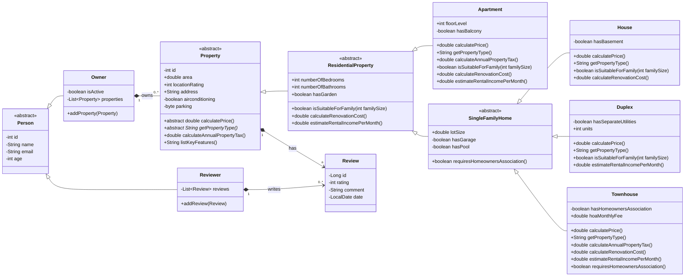

# Integration Documentation: Real Estate Management System

This document details the fusion of the User Management and Property Hierarchy UML models, including the implemented polymorphic business logic.

---
## Uml integration diagram



---
  [⬅️ Back to Index](../README.md#table-of-contents)

---

## 1. Key Changes Performed

The integration focused on unifying the `Apartment` class and scaling relationships to allow for a more flexible and robust system.

* **Owner Generalization (`Owner`):** The relationship was modified so that an owner possesses a list of `Property` objects instead of just `Apartment`. This allows a user to own houses, duplexes, or townhouses interchangeably.
* **Relocation of Physical Attributes:**
    * **Comfort Attributes:** Features such as air conditioning, heating, and parking were moved to the `Property` base class.
    * **Living Attributes:** Room counts, bathrooms, and guest rooms were moved to the `ResidentialProperty` class.
* **Unified Review System:** The `Review` class is now linked to `Property`. This enables any type of property in the hierarchy to receive ratings and comments.
    * 
* **Branch Specialization:** Logic for multi-family dwellings was separated from single-family homes (`SingleFamilyHome`) to support specific attributes like lot size or Homeowners Association (HOA) fees.

---

## 2. Polymorphic Implementation Notes

The architecture allows the system to behave intelligently based on the specific type of object it is handling.

### A. Type Management and Description
* **`getPropertyType()`**: Implemented as an abstract method in `Property`. It forces every child class to identify itself (e.g., "Duplex (2 Units)"). This facilitates report generation without needing `instanceof` checks.
* **`listKeyFeatures()`**: Utilizes **behavioral extension**. The base class returns basic data (area and address), and each subclass performs a `return super.listKeyFeatures() + ...` to append its unique features like "Pool" or "Balcony".

### B. Financial Logic and Costs
* **`calculateAnnualPropertyTax()`**:
    * *Base:* Calculated price × base tax rate.
    * *Specialization:* In `Townhouse`, it is overridden to include annual HOA fees in the tax calculation.
* **`estimateRentalIncomePerMonth()`**:
    * Defines default logic in `ResidentialProperty`. 
    * In `Duplex`, complex logic is implemented to sum the rent of both units and add a bonus if utilities (`separateUtilities`) are metered separately.

### C. Business Rules and Classification
* **`isSuitableForFamily(int familySize)`**:
    * In `Apartment`, the logic is restrictive (based on the ratio of bathrooms per person).
    * In `House`, suitability increases if the `hasGarden` attribute is true, regardless of whether the room count is tight.
* **`requiresHomeownersAssociation()`**: 
    * Method introduced in the `SingleFamilyHome` branch. It defaults to `false` but is strictly overridden in `Townhouse` to return `true`.

---

## 3. Recommended Implementation Strategy

To validate this design, the following test flow is suggested to demonstrate runtime polymorphism:

1.  **Heterogeneous Collection:** Create a `List<Property>` containing instances of `House`, `Apartment`, and `Townhouse`.
2.  **Polymorphic Iteration:**
    ```java
    for (Property p : propertyList) {
        System.out.println("Type: " + p.getPropertyType());
        System.out.println("Taxes: " + p.calculateAnnualPropertyTax());
        System.out.println("Features: " + p.listKeyFeatures());
    }
    ```
3.  **Logical Filtering:** Use the `isSuitableForFamily(n)` method to filter properties that meet specific client requirements, observing how each object applies its own business rules.


----

## 1. Cambios Principales Realizados

La integración se centró en unificar la clase `Apartment` y escalar las relaciones para permitir un sistema más flexible y robusto.

* **Generalización del Dueño (`Owner`):** Se modificó la relación para que el dueño posea una lista de `Property` en lugar de solo `Apartment`. Esto permite que un usuario sea dueño de casas, dúplex o townhouses indistintamente.
* **Reubicación de Atributos Físicos:**
    * Los atributos de confort (aire acondicionado, calefacción, parking) se movieron a la clase base `Property`.
    * Los atributos de habitabilidad (habitaciones, baños, cuarto de invitados) se movieron a `ResidentialProperty`.
* **Sistema de Reseñas Unificado:** La clase `Review` ahora se vincula con `Property`. Esto habilita que cualquier tipo de propiedad en la jerarquía pueda recibir calificaciones y comentarios.
* **Especialización de Ramas:** Se separó la lógica de viviendas multifamiliares de las unifamiliares (`SingleFamilyHome`) para dar soporte a atributos específicos como tamaño del lote o cuotas de asociación (HOA).

---

## 2. Notas sobre la Implementación Polimórfica

La arquitectura permite que el sistema se comporte de manera inteligente según el tipo de objeto que esté manejando.

### A. Gestión de Tipos y Descripción
* **`getPropertyType()`**: Implementado como método abstracto en `Property`. Obliga a cada clase hija a identificarse (ej. "Duplex (2 Units)"). Esto facilita la generación de reportes sin necesidad de usar `instanceof`.
* **`listKeyFeatures()`**: Utiliza **extensión de comportamiento**. La clase base devuelve datos básicos (área y dirección), y cada subclase hace un `return super.listKeyFeatures() + ...` para añadir sus características únicas como "Piscina" o "Balcón".

### B. Lógica Financiera y Costos
* **`calculateAnnualPropertyTax()`**:
    * *Base:* Precio calculado × tasa impositiva base.
    * *Especialización:* En `Townhouse` se sobreescribe para incluir los costos de la asociación de vecinos en el cálculo anual.
* **`estimateRentalIncomePerMonth()`**:
    * Define una lógica por defecto en `ResidentialProperty`. 
    * En `Duplex`, se implementa una lógica compleja que suma la renta de ambas unidades y añade un bono si los servicios públicos (`separateUtilities`) están separados.

### C. Reglas de Negocio y Clasificación
* **`isSuitableForFamily(int familySize)`**:
    * En `Apartment`, la lógica es restrictiva (basada en la proporción de baños por persona).
    * En `House`, la idoneidad aumenta si el atributo `hasGarden` es verdadero, independientemente de si el número de habitaciones es justo.
* **`requiresHomeownersAssociation()`**: 
    * Método introducido en la rama `SingleFamilyHome`. Por defecto es `false`, pero es sobreescrito obligatoriamente en `Townhouse` para devolver `true`.

---

## 3. Estrategia de Prueba Recomendada

Para validar esta implementación, se sugiere un flujo de prueba que demuestre el polimorfismo en tiempo de ejecución:

1.  **Colección Heterogénea:** Crear una `List<Property>` que contenga instancias de `House`, `Apartment` y `Townhouse`.
2.  **Iteración Polimórfica:**
    ```java
    for (Property p : listaPropiedades) {
        System.out.println("Tipo: " + p.getPropertyType());
        System.out.println("Impuestos: " + p.calculateAnnualPropertyTax());
        System.out.println("Características: " + p.listKeyFeatures());
    }
    ```
3.  **Filtrado Lógico:** Usar el método `isSuitableForFamily(n)` para filtrar propiedades que cumplan con los requisitos de un cliente específico, observando cómo cada objeto aplica sus propias reglas de negocio.
