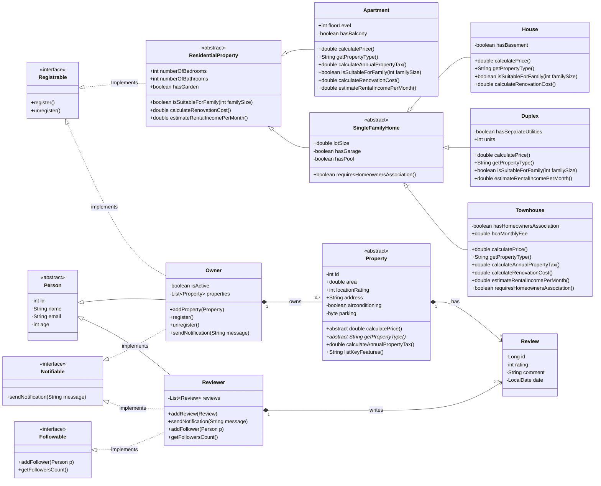

# Technical Documentation: Real Estate Management System (Java Implementation)

This document details the fusion of the User Management and Property Hierarchy UML models, including the implemented polymorphic business logic.

---
## Uml integration diagram



---
  [⬅️ Back to Index](../README.md#table-of-contents)

---

## 1. Architectural Overview & Design Patterns

The system follows a robust Object-Oriented Programming (OOP) foundation, leveraging inheritance, abstraction, and interface-driven design to manage a complex real estate ecosystem.

### A. Interface-Driven Behavior (Decoupling)
To separate "identity" from "capability," we implemented specific interfaces that define what an object can do, regardless of its position in the class hierarchy:

* **Registrable**: Implemented by `Owner` and `ResidentialProperty`. It standardizes the registration process for users and the formal listing of assets.
    * *Methods*: `register()`, `unregister()`.
* **Notifiable**: Implemented by `Owner` and `Reviewer`. It creates a polymorphic messaging bridge.
    * *Methods*: `sendNotification(String message)`.
* **Followable**: Exclusive to `Reviewer`, enabling social networking features.
    * *Methods*: `addFollower(Person p)`, `getFollowersCount()`.

### B. Multi-Level Class Hierarchy
The architecture uses structured inheritance to maximize code reuse and data integrity:
* **Person (Abstract)**: Centralizes common identity fields like `id`, `name`, `email`, and `age`.
* **Property (Abstract)**: The root for all real estate assets, defining core logic for taxes and features.
* **ResidentialProperty & SingleFamilyHome**: Intermediate abstract classes that act as logical filters for attributes like `numberOfBedrooms` or `lotSize`.

---

## 2. Key Structural Changes

The integration unified separate models into a scalable system:

* **Owner Generalization**: The `Owner` now possesses a `List<Property>` instead of just apartments, allowing management of diverse portfolios (Houses, Duplexes, etc.).
* **Attribute Relocation**: 
    * **Comfort Attributes**: Features like `airconditioning` and `parking` moved to the base `Property` class.
    * **Living Attributes**: Room and bathroom counts moved to `ResidentialProperty`.
* **Unified Review System**: The `Review` class is now linked directly to `Property`, enabling feedback for any building type.
* **Branch Specialization**: Logic for multi-family dwellings was separated from `SingleFamilyHome` to support specific fields like `hoaMonthlyFee`.

---

## 3. Polymorphic Implementation Notes

The system behaves intelligently based on the specific object type at runtime:

### A. Type Management
* **`getPropertyType()`**: An abstract method in `Property` that forces subclasses to identify themselves (e.g., "Apartment", "Townhouse"), replacing the need for `instanceof`.
* **`listKeyFeatures()`**: Uses **behavioral extension**. Subclasses call `super.listKeyFeatures()` and append specific details like "Has Garage" or "Has Pool".

### B. Financial & Business Logic
* **`calculateAnnualPropertyTax()`**: 
    * *Base*: Price × base rate.
    * *Override*: `Townhouse` includes HOA fees in the final tax calculation.
* **`isSuitableForFamily(int familySize)`**:
    * `Apartment` uses restrictive bathroom-to-person ratios.
    * `House` provides a "suitability bonus" if `hasGarden` is true.
* **`estimateRentalIncomePerMonth()`**:
    * `Duplex` calculates income based on two units and utility separation.
    * `Townhouse` adjusts for maintenance costs.

---

## 4. Implementation & Testing Strategy

To validate the design, the following Java test flow is recommended to observe runtime polymorphism:

1. **Heterogeneous Collection**: Store different objects in a single list: `List<Property> propertyList = new ArrayList<>();`.
2. **Polymorphic Loop**:
   ```java
   for (Property p : propertyList) {
       System.out.println("Building Type: " + p.getPropertyType());
       System.out.println("Yearly Tax: " + p.calculateAnnualPropertyTax());
       System.out.println("Suitability: " + ((ResidentialProperty)p).isSuitableForFamily(4));
   }

---
