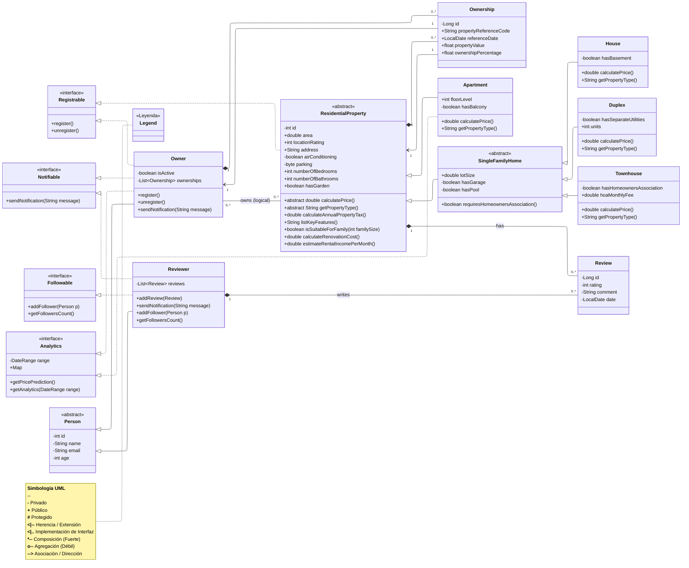

# Technical Documentation: Real Estate Management System (Java Implementation)

This document details the fusion of the User Management and Property Hierarchy UML models, including the implemented polymorphic business logic.

---
## Uml integration diagram



---
  [⬅️ Back to Index](../README.md#table-of-contents)

---

# 0 UML Notation Guide

To ensure the architecture is crystal clear, here is the breakdown of the specific symbols and relationships used in your diagram:

---

## 0.1 Relationships & Arrows

- **Filled Diamond (`--*`) — Composition**  
  Represents a "strong" ownership. If the "parent" object is destroyed, the "child" objects are also destroyed.  

  **Example:**  
  If an `Owner` is deleted from the system, their `Ownership` records disappear because they cannot exist without a reference to a person.

- **Solid Arrow with Hollow Triangle (`--|>`) — Inheritance / Generalization**  
  Indicates that a class is a specific subtype of another.  

  **Example:**  
  An `Apartment` is a `ResidentialProperty`. It inherits all attributes (like address) from the parent.

- **Dashed Arrow with Hollow Triangle (`..|>`) — Realization / Implementation**  
  Used when a class implements an Interface. It is a contract stating the class will provide the logic for specific methods.  

  **Example:**  
  `Owner` implements `Registrable`, meaning it must contain the logic for `register()` and `unregister()`.

---

## 0.2 Visibility Modifiers

Symbols before an attribute or method define who can access the data:

- `+` **Public:** Accessible by any other class in the system.  
- `-` **Private:** Only accessible within the class itself (Encapsulation).  
- `#` **Protected:** (Optional) Accessible by the class and its subclasses.

---

## 0.3 Class Types

- `<<interface>>`: A blueprint that defines what a class must do, but not how. It contains only method signatures.  
- `<<abstract>>`: A class that acts as a partial template. You cannot create an instance of it directly.  

**Concept:**  
You don't buy a generic `ResidentialProperty`; you buy a specific `House` or `Apartment`. The abstract class just holds the shared logic for all of them.

---

## 1. Architectural Overview & Design Patterns

The system follows a robust Object-Oriented Programming (OOP) foundation, leveraging inheritance, abstraction, and interface-driven design to manage a complex real estate ecosystem.

### A. Interface-Driven Behavior (Decoupling)
To separate "identity" from "capability," we implemented specific interfaces that define what an object can do, regardless of its position in the class hierarchy:

* **Registrable**: Implemented by `Owner` and `ResidentialProperty`. It standardizes the registration process for users and the formal listing of assets.
    * *Methods*: `register()`, `unregister()`.
* **Notifiable**: Implemented by `Owner` and `Reviewer`. It creates a polymorphic messaging bridge.
    * *Methods*: `sendNotification(String message)`.
* **Followable**: Exclusive to `Reviewer`, enabling social networking features.
    * *Methods*: `addFollower(Person p)`, `getFollowersCount()`.

### B. Multi-Level Class Hierarchy
The architecture uses structured inheritance to maximize code reuse and data integrity:
* **Person (Abstract)**: Centralizes common identity fields like `id`, `name`, `email`, and `age`.
* **ResidentialProperty (Abstract)**: The root of the real estate hierarchy. It consolidates all core structural, location, and pricing logic common to residential assets.
* **SingleFamilyHome (Abstract)**: Acts as a specialized branch for single-family dwelling properties.
* **Ownership (Entity)**: Serves as the join entity enabling many-to-many relationships between `Owner` and `ResidentialProperty` while storing ownership-specific attributes.

---

## 2. Key Structural Changes

The integration unified separate models into a scalable system:

* **Owner Generalization**: The `Owner` now manages a `List<Ownership>` instead of a direct list of properties, allowing polymorphic and partial ownership management.
* **Property Fusion**: The former abstract `Property` class has been fully merged into `ResidentialProperty`, consolidating all shared attributes (area, address, air conditioning, parking) and core business logic.
* **Ownership Modeling**: Direct many-to-many ownership between `Owner` and `ResidentialProperty` has been replaced by the `Ownership` entity. Each ownership record stores attributes like `propertyReferenceCode`, `referenceDate`, `propertyValue`, and `ownershipPercentage`.
* **Logical vs Physical Relationships**: A visual many-to-many link between `Owner` and `ResidentialProperty` is maintained in UML for conceptual clarity, but actual persistence relies exclusively on the `Ownership` entity.
* **Unified Review System**: Reviews are now associated directly with `ResidentialProperty`, preserving the previous many-to-many design visually while reflecting a one-to-many JPA implementation.
* **Branch Specialization**: Logic for multi-family dwellings was separated from `SingleFamilyHome` to support specific fields like `hoaMonthlyFee`.

---

## 3. Polymorphic Implementation Notes

The system behaves intelligently based on the specific object type at runtime:

### A. Type Management
* **`getPropertyType()`**: An abstract method in `ResidentialProperty` that forces each concrete subclass to self-identify without relying on `instanceof`.
* **`listKeyFeatures()`**: Uses **behavioral extension**. Subclasses call `super.listKeyFeatures()` and append specific details like "Has Garage" or "Has Pool".
* **Ownership Entity**: The `Ownership` class allows capturing domain-specific details for each owner-property relationship, providing a persistent way to handle co-ownership, historical values, and percentages.

### B. Financial & Business Logic
* **`calculateAnnualPropertyTax()`**:
    * *Base*: Price × base rate.
    * *Override*: `Townhouse` includes HOA fees in the final tax calculation.
* **`isSuitableForFamily(int familySize)`**:
    * `Apartment` uses restrictive bathroom-to-person ratios.
    * `House` provides a "suitability bonus" if `hasGarden` is true.
* **`estimateRentalIncomePerMonth()`**:
    * `Duplex` calculates income based on two units and utility separation.
    * `Townhouse` adjusts for maintenance costs.

---

## 4. Implementation & Testing Strategy

To validate the design, the following Java test flow is recommended to observe runtime polymorphism:

1. **Heterogeneous Collection**: Store different objects in a single list: `List<ResidentialProperty> propertyList = new ArrayList<>();`.
2. **Polymorphic Loop**:
   ```java
   for (ResidentialProperty p : propertyList) {
       System.out.println("Building Type: " + p.getPropertyType());
       System.out.println("Yearly Tax: " + p.calculateAnnualPropertyTax());
       System.out.println("Suitability: " + p.isSuitableForFamily(4));
   }
   ```

3. **Ownership Testing**: To validate the many-to-many association with attributes:
   ```java
   Ownership ownership = new Ownership();
   ownership.setOwner(owner);
   ownership.setResidentialProperty(property);
   ownership.setPropertyReferenceCode("PROP-001");
   ownership.setReferenceDate(LocalDate.now());
   ownership.setPropertyValue(250000f);
   ownership.setOwnershipPercentage(50f);
   owner.getOwnerships().add(ownership);
   property.getOwnerships().add(ownership);
   ```

This ensures proper linkage and persistence of ownership records while maintaining correct polymorphic behavior of the property hierarchy.

---
