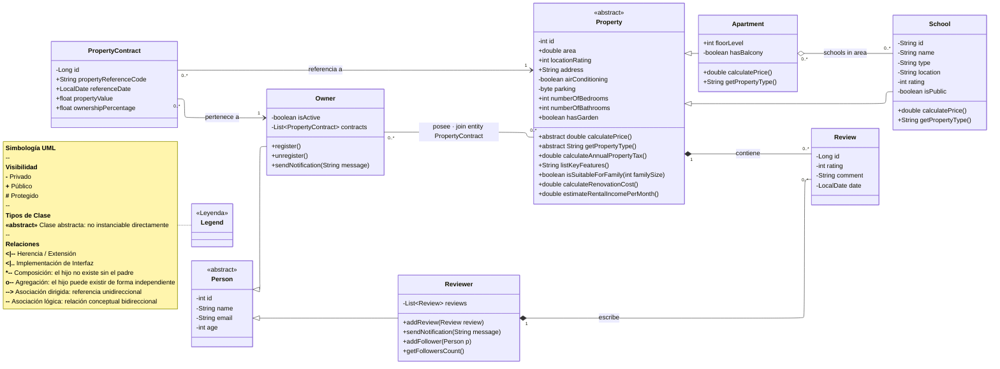

# Technical Documentation: Real Estate Management System — UML v1



---

## Notas de diseño — V1

- **`School`** hereda de `Property` y se relaciona con `Apartment` mediante **agregación many-to-many unidireccional** (`Apartment` es el lado owner). JPA genera la join table automáticamente sin entidad intermedia explícita.
- **`PropertyContract`** es la **join entity explícita** que resuelve la relación muchos-a-muchos entre `Owner` y `Property`. A diferencia de la relación Apartment→School, aquí la tabla de unión es una entidad de dominio con atributos propios (valor, porcentaje, fecha), por lo que JPA la mapea a través de esta clase y no de forma automática.
- **`Person`** es abstracta: no se instancia directamente. `Owner` y `Reviewer` son sus únicas especializaciones en V1.
- **`Property`** es abstracta: el único subtipo concreto en V1 es `Apartment`. Subtipos como `House`, `Duplex` y `Townhouse` se incorporarán en versiones posteriores.
- **`Review`** es propiedad tanto de `Property` (composición física) como de `Reviewer` (composición autoral). Ambas composiciones son válidas: una `Review` no existe sin su propiedad ni sin su autor.
- Las **interfaces** (`Registrable`, `Notifiable`, `Followable`) y las clases `SingleFamilyHome`, `House`, `Duplex`, `Townhouse` y `Analytics` quedan diferidas para versiones posteriores.
- La **asociación lógica** `Owner -- Property` se mantiene como referencia conceptual; la persistencia real se gestiona exclusivamente a través de `PropertyContract`.

---

## JPA Inheritance Strategies — Lab Practice Guide

The UML contains **two inheritance hierarchies** that must be mapped to relational tables. JPA offers four mechanisms. Each hierarchy is a different exercise opportunity to practice all of them.

| Hierarchy | Root (abstract) | Concrete subclasses in V1 |
|-----------|-----------------|---------------------------|
| **A** | `Person` | `Owner`, `Reviewer` |
| **B** | `Property` | `Apartment`, `School` |

---

### Strategy 1 — `@MappedSuperclass`

> The parent class is **not an entity** and has **no table**. It only shares field definitions and JPA annotations. Each subclass gets its own fully independent table with all columns (inherited + own). No polymorphic queries on the parent type are possible.

**Applied to Hierarchy A — `Person`:**

```
@MappedSuperclass
public abstract class Person {
    @Id @GeneratedValue(strategy = GenerationType.IDENTITY)
    private Long id;
    private String name;
    private String email;
    private int age;
}

@Entity
@Table(name = "owner")
public class Owner extends Person {
    private boolean isActive;
}

@Entity
@Table(name = "reviewer")
public class Reviewer extends Person {
    // reviewer-specific fields
}
```

**Resulting H2 tables:**

```
TABLE: owner
┌────┬──────┬───────┬─────┬──────────┐
│ id │ name │ email │ age │ isActive │
└────┴──────┴───────┴─────┴──────────┘

TABLE: reviewer
┌────┬──────┬───────┬─────┐
│ id │ name │ email │ age │
└────┴──────┴───────┴─────┘

NO person table is created.
```

**Trade-offs:**

| ✅ Advantages | ❌ Disadvantages |
|--------------|----------------|
| Simple queries, no JOINs | `id` sequences are independent per table |
| Clean, isolated schema | No `SELECT * FROM person` possible |
| Best performance for single-type queries | Columns duplicated across tables |

---

### Strategy 2 — `SINGLE_TABLE` (`InheritanceType.SINGLE_TABLE`)

> All classes in the hierarchy share **a single table**. A `DTYPE` discriminator column identifies the concrete type of each row. Columns specific to subclasses are nullable for rows of other types.

**Applied to Hierarchy A — `Person`:**

```java
@Entity
@Inheritance(strategy = InheritanceType.SINGLE_TABLE)
@DiscriminatorColumn(name = "person_type")
@Table(name = "person")
public abstract class Person {
    @Id @GeneratedValue(strategy = GenerationType.IDENTITY)
    private Long id;
    private String name;
    private String email;
    private int age;
}

@Entity
@DiscriminatorValue("OWNER")
public class Owner extends Person {
    private boolean isActive;
}

@Entity
@DiscriminatorValue("REVIEWER")
public class Reviewer extends Person {
    // reviewer-specific fields
}
```

**Resulting H2 table:**

```
TABLE: person
┌────┬─────────────┬──────┬───────┬─────┬──────────┐
│ id │ person_type │ name │ email │ age │ isActive │
├────┼─────────────┼──────┼───────┼─────┼──────────┤
│  1 │ OWNER       │ Marc │ ...   │  35 │ true     │
│  2 │ REVIEWER    │ Anna │ ...   │  28 │ NULL     │
└────┴─────────────┴──────┴───────┴─────┴──────────┘
```

**Trade-offs:**

| ✅ Advantages | ❌ Disadvantages |
|--------------|----------------|
| Fastest queries (no JOIN, no UNION) | Nullable columns for subclass-specific fields |
| Simplest schema — one table | Table grows wide with deep hierarchies |
| Full polymorphic query support | Schema not normalized |
| JPA default strategy | Harder to add NOT NULL constraints |

---

### Strategy 3 — `TABLE_PER_CLASS` (`InheritanceType.TABLE_PER_CLASS`)

> A **separate table for each concrete class**, each containing all columns (inherited + own). The root abstract class has no table. Polymorphic queries are possible but use a `UNION ALL` internally, which is expensive.

**Applied to Hierarchy B — `Property`:**

```java
@Entity
@Inheritance(strategy = InheritanceType.TABLE_PER_CLASS)
public abstract class Property {
    @Id @GeneratedValue(strategy = GenerationType.AUTO) // AUTO required, not IDENTITY
    private Long id;
    private double area;
    private String address;
    private int locationRating;
    // ... all shared fields
}

@Entity
@Table(name = "apartment")
public class Apartment extends Property {
    private int floorLevel;
    private boolean hasBalcony;
}

@Entity
@Table(name = "school")
public class School extends Property {
    private String type;
    private int rating;
    private boolean isPublic;
}
```

**Resulting H2 tables:**

```
TABLE: apartment
┌────┬──────┬─────────┬───────────────┬────────────┬─────────────┐
│ id │ area │ address │ locationRating │ floorLevel │ hasBalcony  │
└────┴──────┴─────────┴───────────────┴────────────┴─────────────┘

TABLE: school
┌────┬──────┬─────────┬───────────────┬──────┬────────┬──────────┐
│ id │ area │ address │ locationRating │ type │ rating │ isPublic │
└────┴──────┴─────────┴───────────────┴──────┴────────┴──────────┘

NO property table is created.
Polymorphic query → UNION ALL between apartment + school.
```

**Trade-offs:**

| ✅ Advantages | ❌ Disadvantages |
|--------------|----------------|
| Full polymorphism support | `UNION ALL` queries are slow at scale |
| Clean OO design | Requires `GenerationType.AUTO` (not `IDENTITY`) |
| No nullable columns | Schema evolution is hard |
| Each table is self-contained | Not recommended for large or deep hierarchies |

---

### Strategy 4 — `JOINED` (`InheritanceType.JOINED`)

> The **most normalized** strategy. The parent class has its own table with shared fields. Each subclass has its own table with only its specific fields, linked to the parent by a shared primary key (`JOIN`). This is the closest mapping to the UML diagram.

**Applied to Hierarchy B — `Property`:**

```java
@Entity
@Inheritance(strategy = InheritanceType.JOINED)
@Table(name = "property")
public abstract class Property {
    @Id @GeneratedValue(strategy = GenerationType.IDENTITY)
    private Long id;
    private double area;
    private String address;
    private int locationRating;
    // ... all shared fields
}

@Entity
@Table(name = "apartment")
public class Apartment extends Property {
    private int floorLevel;
    private boolean hasBalcony;
}

@Entity
@Table(name = "school")
public class School extends Property {
    private String type;
    private int rating;
    private boolean isPublic;
}
```

**Resulting H2 tables:**

```
TABLE: property  ← shared fields
┌────┬──────┬─────────┬───────────────┬──────────────────┐
│ id │ area │ address │ locationRating │ DTYPE (optional) │
├────┼──────┼─────────┼───────────────┼──────────────────┤
│  1 │ 85.0 │ Carrer  │             8 │ Apartment        │
│  2 │  0.0 │ Passeig │             9 │ School           │
└────┴──────┴─────────┴───────────────┴──────────────────┘

TABLE: apartment  ← subclass-specific fields + FK to property
┌────┬────────────┬────────────┐
│ id │ floorLevel │ hasBalcony │
├────┼────────────┼────────────┤
│  1 │          3 │ true       │
└────┴────────────┴────────────┘

TABLE: school  ← subclass-specific fields + FK to property
┌────┬──────────┬────────┬──────────┐
│ id │ type     │ rating │ isPublic │
├────┼──────────┼────────┼──────────┤
│  2 │ Public   │      9 │ true     │
└────┴──────────┴────────┴──────────┘

Query for Apartment → JOIN property + apartment ON id
```

**Trade-offs:**

| ✅ Advantages | ❌ Disadvantages |
|--------------|----------------|
| Fully normalized schema — no null columns | Requires JOIN per query |
| Mirrors the UML structure exactly | More complex SQL generated by JPA |
| Supports full polymorphism | Slower than SINGLE_TABLE for reads |
| Easy to add NOT NULL constraints | JOIN depth grows with hierarchy depth |

---

### Strategy Comparison Matrix

| Strategy | Tables created | Polymorphic query | JOIN needed | Null columns | Best for |
|---|---|---|---|---|---|
| `@MappedSuperclass` | 1 per **concrete** class | ❌ No | ❌ No | ❌ No | Isolated entities, no shared queries |
| `SINGLE_TABLE` | 1 for **entire** hierarchy | ✅ Yes | ❌ No | ⚠️ Yes | Simple hierarchies, read performance |
| `TABLE_PER_CLASS` | 1 per **concrete** class | ✅ Yes (UNION) | ❌ No | ❌ No | Moderate hierarchies, OO purity |
| `JOINED` | 1 per **class** (root + all subs) | ✅ Yes | ✅ Yes | ❌ No | Normalized schemas, complex domains |

---

### Applied Recommendation for PRA#02

For **Hierarchy A (`Person → Owner, Reviewer`)** the lab requires choosing **Option A (`@MappedSuperclass`)** or **Option B (`TABLE_PER_CLASS`)**. Both are valid for V1:

- Use `@MappedSuperclass` if you want the simplest schema and never need `SELECT * FROM person`.
- Use `TABLE_PER_CLASS` if you want to practice polymorphic queries via `PersonRepository.findAll()`.

For **Hierarchy B (`Property → Apartment, School`)**, `JOINED` is the academically richest choice as it mirrors the UML exactly and produces a schema that is easy to inspect in the H2 console. `SINGLE_TABLE` is the fastest to implement and debug.

> **Key constraint:** `@MappedSuperclass` cannot be combined with `@Entity` on the same class. If `Person` uses `@MappedSuperclass`, there is no `PersonRepository` — only `OwnerRepository` and `ReviewerRepository`.
