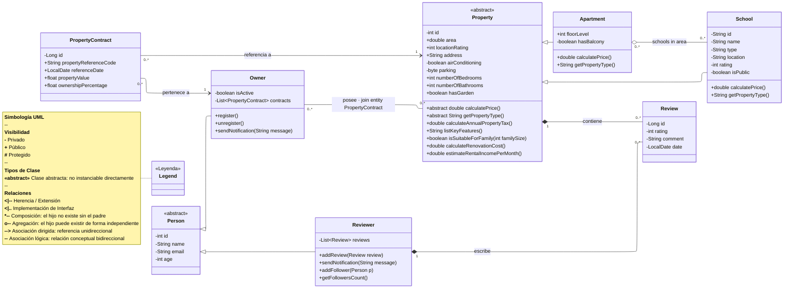

# Documentació Tècnica: Sistema de Gestió Immobiliària — UML v1



---

## Notes de disseny — V1

- **`School`** hereta de `Property` i es relaciona amb `Apartment` mitjançant **agregació many-to-many unidireccional** (`Apartment` és el costat owner). JPA genera la join table automàticament sense entitat intermèdia explícita.
- **`PropertyContract`** és la **join entity explícita** que resol la relació molts-a-molts entre `Owner` y `Property`. A diferència de la relació Apartment→School, aquí la taula d'unió és una entitat de domini amb atributs propis (valor, porcentaje, fecha), per la qual cosa JPA la mapeja a través d'aquesta classe i no de forma automàtica.
- **`Person`** és abstracta: no s'instancia directament. `Owner` i `Reviewer` són les seves úniques especialitzacions en V1.
- **`Property`** és abstracta: l'únic subtipus concret en V1 és `Apartment`. Subtipus com `House`, `Duplex` i `Townhouse` s'incorporaran en versions posteriors.
- **`Review`** és propietat tant de `Property` (composició física) com de `Reviewer` (composició autoral). Ambdues composicions són vàlides: una `Review` no existeix sense la seva propietat ni sense el seu autor.
- Les **interfícies** (`Registrable`, `Notifiable`, `Followable`) i les classes `SingleFamilyHome`, `House`, `Duplex`, `Townhouse` i `Analytics` queden diferides per a versions posteriors..
- L'**associació lògica** `Owner -- Property` es manté com a referència conceptual; la persistència real es gestiona exclusivament a través de `PropertyContract`.

---

## Estratègies d'Herència JPA — Guia de Pràctica de Laboratori

L'UML conté **dues jerarquies d'herència** que s'han de mapejar a taules relacionals. JPA ofereix quatre mecanismes. Cada jerarquia és una oportunitat d'exercici diferent per practicar-los tots.

| Jerarquia | Arrel (abstracta) | Subclasses concretes en V1 |
|-----------|-----------------|---------------------------|
| **A** | `Person` | `Owner`, `Reviewer` |
| **B** | `Property` | `Apartment`, `School` |

---

### Estratègia 1 — `@MappedSuperclass`

> The parent class is **not an entity** and has **no table**. It only shares field definitions and JPA annotations. Each subclass gets its own fully independent table with all columns (inherited + own). No polymorphic queries on the parent type are possible.

**Aplicat a la Jerarquia A — `Person`:**

```
@MappedSuperclass
public abstract class Person {
    @Id @GeneratedValue(strategy = GenerationType.IDENTITY)
    private Long id;
    private String name;
    private String email;
    private int age;
}

@Entity
@Table(name = "owner")
public class Owner extends Person {
    private boolean isActive;
}

@Entity
@Table(name = "reviewer")
public class Reviewer extends Person {
    // reviewer-specific fields
}
```

**Taules H2 resultants:**

```
TABLE: owner
┌────┬──────┬───────┬─────┬──────────┐
│ id │ name │ email │ age │ isActive │
└────┴──────┴───────┴─────┴──────────┘

TABLE: reviewer
┌────┬──────┬───────┬─────┐
│ id │ name │ email │ age │
└────┴──────┴───────┴─────┘

NO person table is created.
```

**Avantatges i inconvenients:**

| ✅ Avantatges | ❌ Inconvenients |
|--------------|----------------|
| Consultes simples, sense JOINs | Les seqüències d'`id` són independents per taula |
| Esquema net i aïllat | No és possible `SELECT * FROM person` |
| Millor rendiment per a consultes d'un sol tipus | Columnes duplicades entre taules |

---

### Estratègia 2 — `SINGLE_TABLE` (`InheritanceType.SINGLE_TABLE`)

> All classes in the hierarchy share **a single table**. A `DTYPE` discriminator column identifies the concrete type of each row. Columns specific to subclasses are nullable for rows of other types.

**Aplicat a la Jerarquia A — `Person`:**

```java
@Entity
@Inheritance(strategy = InheritanceType.SINGLE_TABLE)
@DiscriminatorColumn(name = "person_type")
@Table(name = "person")
public abstract class Person {
    @Id @GeneratedValue(strategy = GenerationType.IDENTITY)
    private Long id;
    private String name;
    private String email;
    private int age;
}

@Entity
@DiscriminatorValue("OWNER")
public class Owner extends Person {
    private boolean isActive;
}

@Entity
@DiscriminatorValue("REVIEWER")
public class Reviewer extends Person {
    // reviewer-specific fields
}
```

**Taula H2 resultant:**

```
TABLE: person
┌────┬─────────────┬──────┬───────┬─────┬──────────┐
│ id │ person_type │ name │ email │ age │ isActive │
├────┼─────────────┼──────┼───────┼─────┼──────────┤
│  1 │ OWNER       │ Marc │ ...   │  35 │ true     │
│  2 │ REVIEWER    │ Anna │ ...   │  28 │ NULL     │
└────┴─────────────┴──────┴───────┴─────┴──────────┘
```

**Avantatges i inconvenients:**

| ✅ Avantatges | ❌ Inconvenients |
|--------------|----------------|
| Consultes més ràpides (sense JOIN, sense UNION) | Columnes nullables per als camps específics de subclasse |
| Esquema més simple — una sola taula | La taula creix en amplada amb jerarquies profundes |
| Suport complet de consultes polimòrfiques | Esquema no normalitzat |
| Estratègia per defecte de JPA | Més difícil afegir restriccions NOT NULL |

---

### Estratègia 3 — `TABLE_PER_CLASS` (`InheritanceType.TABLE_PER_CLASS`)

> A **separate table for each concrete class**, each containing all columns (inherited + own). The root abstract class has no table. Polymorphic queries are possible but use a `UNION ALL` internally, which is expensive.

**Aplicat a la Jerarquia B — `Property`:**

```java
@Entity
@Inheritance(strategy = InheritanceType.TABLE_PER_CLASS)
public abstract class Property {
    @Id @GeneratedValue(strategy = GenerationType.AUTO) // AUTO required, not IDENTITY
    private Long id;
    private double area;
    private String address;
    private int locationRating;
    // ... all shared fields
}

@Entity
@Table(name = "apartment")
public class Apartment extends Property {
    private int floorLevel;
    private boolean hasBalcony;
}

@Entity
@Table(name = "school")
public class School extends Property {
    private String type;
    private int rating;
    private boolean isPublic;
}
```

**Taules H2 resultants:**

```
TABLE: apartment
┌────┬──────┬─────────┬───────────────┬────────────┬─────────────┐
│ id │ area │ address │ locationRating │ floorLevel │ hasBalcony  │
└────┴──────┴─────────┴───────────────┴────────────┴─────────────┘

TABLE: school
┌────┬──────┬─────────┬───────────────┬──────┬────────┬──────────┐
│ id │ area │ address │ locationRating │ type │ rating │ isPublic │
└────┴──────┴─────────┴───────────────┴──────┴────────┴──────────┘

NO property table is created.
Polymorphic query → UNION ALL between apartment + school.
```

**Avantatges i inconvenients:**

| ✅ Avantatges | ❌ Inconvenients |
|--------------|----------------|
| Full polymorphism support | Les consultes `UNION ALL` són lentes a escala |
| Disseny OO net | Requereix `GenerationType.AUTO` (no `IDENTITY`) |
| No nullable columns | L'evolució de l'esquema és difícil |
| Cada taula és autocontinguda | No recomanat per a jerarquies grans o profundes |

---

### Estratègia 4 — `JOINED` (`InheritanceType.JOINED`)

> The **most normalized** strategy. The parent class has its own table with shared fields. Each subclass has its own table with only its specific fields, linked to the parent by a shared primary key (`JOIN`). This is the closest mapping to the UML diagram.

**Aplicat a la Jerarquia B — `Property`:**

```java
@Entity
@Inheritance(strategy = InheritanceType.JOINED)
@Table(name = "property")
public abstract class Property {
    @Id @GeneratedValue(strategy = GenerationType.IDENTITY)
    private Long id;
    private double area;
    private String address;
    private int locationRating;
    // ... all shared fields
}

@Entity
@Table(name = "apartment")
public class Apartment extends Property {
    private int floorLevel;
    private boolean hasBalcony;
}

@Entity
@Table(name = "school")
public class School extends Property {
    private String type;
    private int rating;
    private boolean isPublic;
}
```

**Taules H2 resultants:**

```
TABLE: property  ← shared fields
┌────┬──────┬─────────┬───────────────┬──────────────────┐
│ id │ area │ address │ locationRating │ DTYPE (optional) │
├────┼──────┼─────────┼───────────────┼──────────────────┤
│  1 │ 85.0 │ Carrer  │             8 │ Apartment        │
│  2 │  0.0 │ Passeig │             9 │ School           │
└────┴──────┴─────────┴───────────────┴──────────────────┘

TABLE: apartment  ← subclass-specific fields + FK to property
┌────┬────────────┬────────────┐
│ id │ floorLevel │ hasBalcony │
├────┼────────────┼────────────┤
│  1 │          3 │ true       │
└────┴────────────┴────────────┘

TABLE: school  ← subclass-specific fields + FK to property
┌────┬──────────┬────────┬──────────┐
│ id │ type     │ rating │ isPublic │
├────┼──────────┼────────┼──────────┤
│  2 │ Public   │      9 │ true     │
└────┴──────────┴────────┴──────────┘

Query for Apartment → JOIN property + apartment ON id
```

**Avantatges i inconvenients:**

| ✅ Avantatges | ❌ Inconvenients |
|--------------|----------------|
| Esquema completament normalitzat — sense columnes null | Requereix JOIN per consulta |
| Reflexa l'estructura UML exactament | SQL més complex generat per JPA |
| Suporta polimorfisme complet | Més lent que SINGLE_TABLE per a lectures |
| Fàcil d'afegir restriccions NOT NULL | La profunditat del JOIN creix amb la jerarquia |

---

### Matriu Comparativa d'Estratègies

| Estratègia | Taules creades | Consulta polimòrfica | JOIN necessari | Columnes null | Millor per a |
|---|---|---|---|---|---|
| `@MappedSuperclass` | 1 per classe **concreta** | ❌ No | ❌ No | ❌ No | Entitats aïllades, sense consultes compartides |
| `SINGLE_TABLE` | 1 per a tota la jerarquia | ✅ Yes | ❌ No | ⚠️ Yes | Jerarquies simples, rendiment de lectura |
| `TABLE_PER_CLASS` | 1 per classe **concreta** | ✅ Yes (UNION) | ❌ No | ❌ No | Jerarquies moderades, puresa OO |
| `JOINED` | 1 per **classe** (arrel + totes les subclasses) | ✅ Yes | ✅ Yes | ❌ No | Esquemes normalitzats, dominis complexos |

---

### Recomanació Aplicada per a PRA#02

Per a la **Jerarquia A (`Person → Owner, Reviewer`)** el laboratori requereix triar **Opció A (`@MappedSuperclass`)** o **Opció B (`TABLE_PER_CLASS`)**. Ambdues són vàlides per a V1:

- Utilitza `@MappedSuperclass` si vols l'esquema més simple i mai necessites `SELECT * FROM person`.
- Utilitza `TABLE_PER_CLASS` si vols practicar consultes polimòrfiques via `PersonRepository.findAll()`.

Per a la **Jerarquia B (`Property → Apartment, School`)**, `JOINED` és l'opció acadèmicament més rica ja que reflexa l'UML exactament i produeix un esquema fàcil d'inspeccionar a la consola H2. `SINGLE_TABLE` és el més ràpid d'implementar i depurar.

> **Restricció clau:** `@MappedSuperclass` no es pot combinar amb `@Entity` a la mateixa classe. Si `Person` utilitza `@MappedSuperclass`, no hi ha `PersonRepository` — només `OwnerRepository` i `ReviewerRepository`.

---

## PRA#02 — Tasques Resum

- Definir i escriure l'**Objectiu del Producte**
- Crear / actualitzar el **diagrama de classes UML** (mermaid)
- Implementar totes les entitats amb **JPA + herència** adequada (jerarquia `Person`)
- Crear els **repositoris Spring Data JPA**
- Poblar la **BD H2** amb dades falses (un sol pas atòmic/commit)
- Implementar les classes **`@RestController`** amb endpoints CRUD
- Provar els endpoints amb **Postman** (exportar la col·lecció)
- Documentar decisions, UML, captures de pantalla (consola H2 + Postman)
