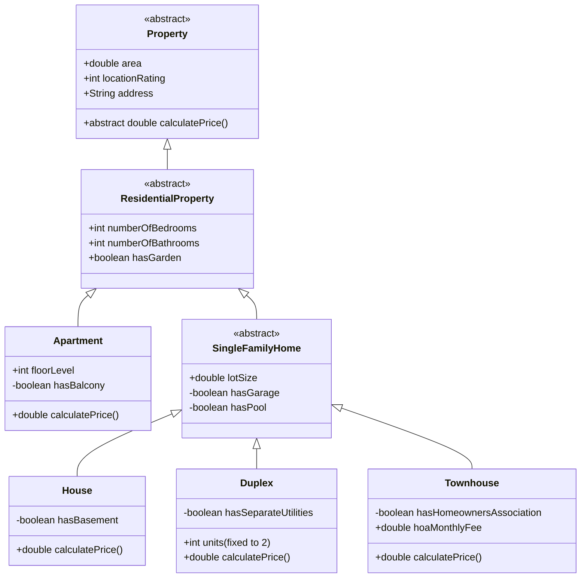

**New Class Hierarchy (Mermaid UML):**

```mermaid
classDiagram
    class Property {
        <<abstract>>
        +double area
        +int locationRating
        +String address
        +abstract double calculatePrice()
    }

    class ResidentialProperty {
        <<abstract>>
        +int numberOfBedrooms
        +int numberOfBathrooms
        +boolean hasGarden
    }

    class Apartment {
        +int floorLevel
        -boolean hasBalcony
        +double calculatePrice()
    }

    class SingleFamilyHome {
        <<abstract>>
        +double lotSize
        -boolean hasGarage
        -boolean hasPool
    }

    class House {
        -boolean hasBasement
        +double calculatePrice()
    }

    class Duplex {
        -boolean hasSeparateUtilities
        +int units (fixed to 2)
        +double calculatePrice()
    }

    class Townhouse {
        -boolean hasHomeownersAssociation
        +double hoaMonthlyFee
        +double calculatePrice()
    }

    Property <|-- ResidentialProperty
    ResidentialProperty <|-- Apartment
    ResidentialProperty <|-- SingleFamilyHome
    SingleFamilyHome <|-- House
    SingleFamilyHome <|-- Duplex
    SingleFamilyHome <|-- Townhouse
```
