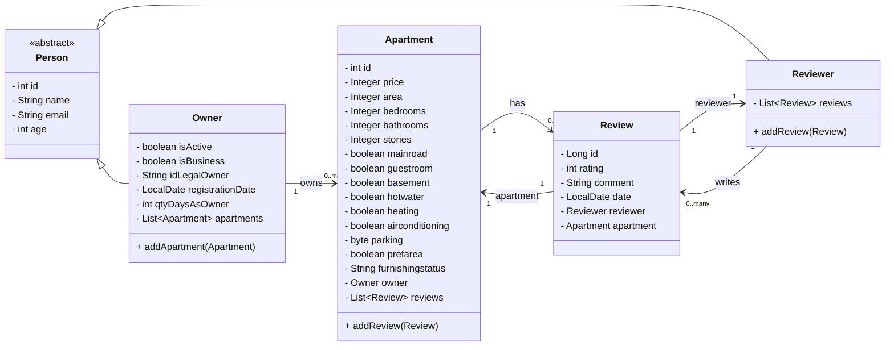

```mermaid

classDiagram
    direction LR

    %% ---- FILA SUPERIOR ----
    %% Subgraph para mantener alineación horizontal
    class Person
    class Owner
    class Reviewer

    %% Forzamos orden relativo
    Person <|-- Owner
    Person <|-- Reviewer

    %% ---- FILA INFERIOR ----
    class Apartment
    class Review

    %% ---- RELACIONES ----
    Owner "1" --> "0..many" Apartment : owns
    Reviewer "1" --> "0..many" Review : writes

    Apartment "1" --> "0..many" Review : has
    Review "1" --> "1" Reviewer : reviewer
    Review "1" --> "1" Apartment : apartment


    %% ---- DETALLES DE CLASES ----

    class Person {
        <<abstract>>
        - int id
        - String name
        - String email
        - int age
    }

    class Owner {
        - boolean isActive
        - boolean isBusiness
        - String idLegalOwner
        - LocalDate registrationDate
        - int qtyDaysAsOwner
        - List~Apartment~ apartments
        + addApartment(Apartment)
    }

    class Reviewer {
        - List~Review~ reviews
        + addReview(Review)
    }

    class Apartment {
        - int id
        - Integer price
        - Integer area
        - Integer bedrooms
        - Integer bathrooms
        - Integer stories
        - boolean mainroad
        - boolean guestroom
        - boolean basement
        - boolean hotwater
        - boolean heating
        - boolean airconditioning
        - byte parking
        - boolean prefarea
        - String furnishingstatus
        - Owner owner
        - List~Review~ reviews
        + addReview(Review)
    }

    class Review {
        - Long id
        - int rating
        - String comment
        - LocalDate date
        - Reviewer reviewer
        - Apartment apartment
    }

```