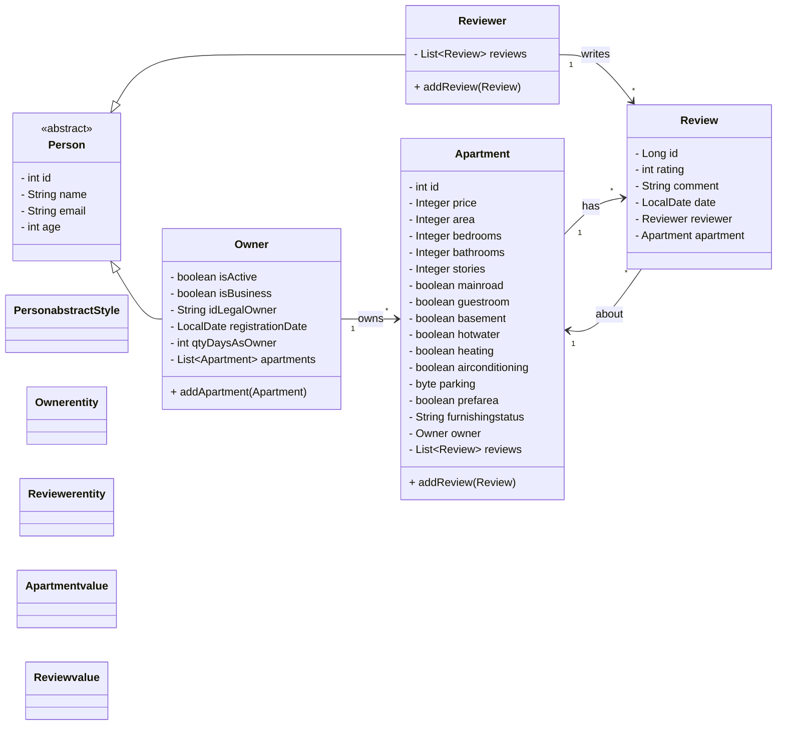

```mermaid
classDiagram
    direction LR

    class Person {
        <<abstract>>
        - int id
        - String name
        - String email
        - int age
    }

    class Owner {
        - boolean isActive
        - boolean isBusiness
        - String idLegalOwner
        - LocalDate registrationDate
        - int qtyDaysAsOwner
        - List~Apartment~ apartments
        + addApartment(Apartment)
    }

    class Reviewer {
        - List~Review~ reviews
        + addReview(Review)
    }

    class Apartment {
        - int id
        - Integer price
        - Integer area
        - Integer bedrooms
        - Integer bathrooms
        - Integer stories
        - boolean mainroad
        - boolean guestroom
        - boolean basement
        - boolean hotwater
        - boolean heating
        - boolean airconditioning
        - byte parking
        - boolean prefarea
        - String furnishingstatus
        - Owner owner
        - List~Review~ reviews
        + addReview(Review)
    }

    class Review {
        - Long id
        - int rating
        - String comment
        - LocalDate date
        - Reviewer reviewer
        - Apartment apartment
    }

    Person <|-- Owner
    Person <|-- Reviewer

    Owner "1" --> "*" Apartment : owns
    Reviewer "1" --> "*" Review : writes
    Apartment "1" --> "*" Review : has
    Review "*" --> "1" Apartment : about

    classDef abstractStyle fill:#f2f2f2,stroke:#333,stroke-width:1.5px,font-weight:bold;
    classDef entity fill:#e8f4ff,stroke:#2b6cb0,stroke-width:1.3px;
    classDef value fill:#fff5e6,stroke:#c77900,stroke-width:1.3px;

    %% Apply styles individually to avoid parsing errors
    class Person abstractStyle
    class Owner entity
    class Reviewer entity
    class Apartment value
    class Review value
```
