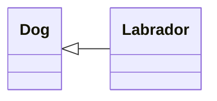
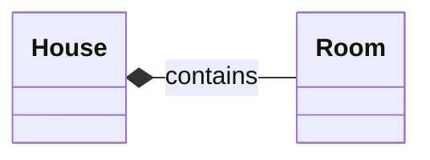
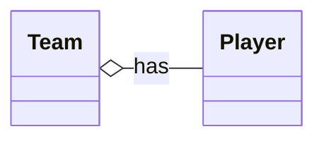
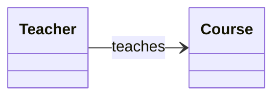

# UML Relationship Types Explained

This document explains the four most common relationship types in UML
class diagrams, using simple language and practical examples.

------------------------------------------------------------------------

## 1. Inheritance (`<|--`)

**Meaning:**\
Represents an "is a type of" relationship. The child class inherits
attributes and behaviors from the parent class.

**Example:**\
- `Dog <|-- Labrador`\
A Labrador *is a type of* dog.

**Usage:**\
Use this when one class is a specialized version of another.

------------------------------------------------------------------------

## 2. Composition (`*--`)

**Meaning:**\
A strong "part of" relationship.\
The part **cannot exist without** the whole.

**Example:**\
- `House *-- Room`\
If the house is destroyed, the rooms cease to exist.

**Usage:**\
Use composition when the lifetime of the part depends on the lifetime of
the whole.

------------------------------------------------------------------------

## 3. Aggregation (`o--`)

**Meaning:**\
A weak "has a" relationship.\
The part **can exist independently** of the whole.

**Example:**\
- `Team o-- Player`\
Players exist even if the team is disbanded.

**Usage:**\
Use aggregation when a class *contains* or *manages* other objects, but
does not "own" them.

------------------------------------------------------------------------

## 4. Association (`-->`)

**Meaning:**\
A general relationship between two classes.\
Describes interaction, communication, or a simple reference.

**Example:**\
- `Teacher --> Course`\
A teacher teaches a course.

**Usage:**\
Use association for most general relationships that don't imply
ownership or dependence.

------------------------------------------------------------------------

## Summary Table

  Symbol   Name          Dependency   Description
  -------- ------------- ------------ ----------------------
  `<|--`   Inheritance   No           "Is a type of"
  `*--`    Composition   Yes          Strong ownership
  `o--`    Aggregation   No           Weak containment
  `-->`    Association   No           General relationship

  | Symbol | Name         | Dependency | Description           | Example Meaning     |
|--------|--------------|------------|------------------------|----------------------|
| `<--` | Inheritance  | No         |Type of relationship         | Dog ← Labrador      |
| `*--`  | Composition  | Yes        | Strong ownership       | House → Rooms       |
| `o--`  | Aggregation  | No         | Weak containment       | Team → Players      |
| `-->`  | Association  | No         | General relationship   | Teacher → Course    |

------------------------------------------------------------------------

## Applying These to Your UML

-   **Owner** and **Reviewer** inherit from **Person** → `<|--`
-   **Owner**, **Reviewer**, **Apartment**, and **Review** use simple
    associations → `-->`
-   You could optionally use composition if `Review` cannot exist
    without an `Apartment`.

------------------------------------------------------------------------

