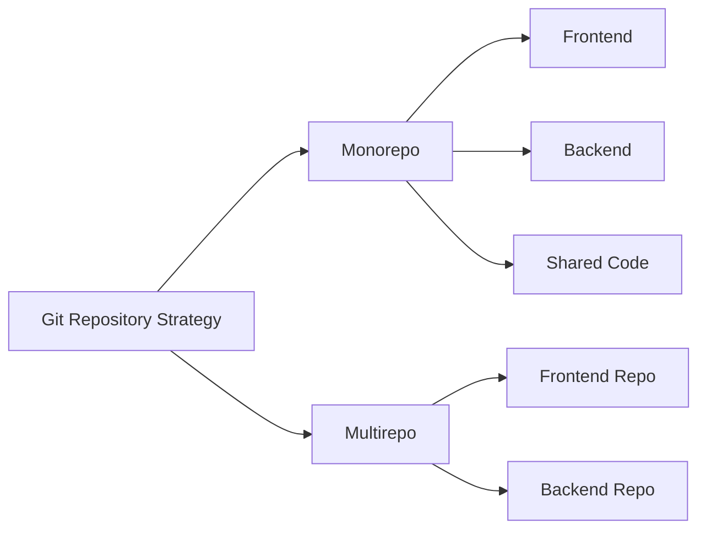
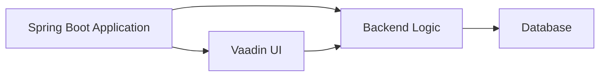
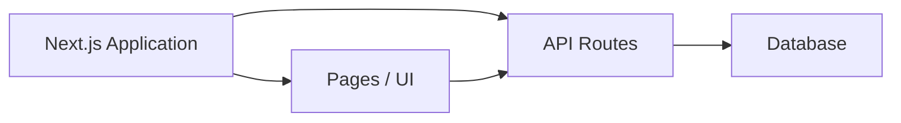
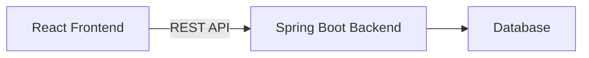
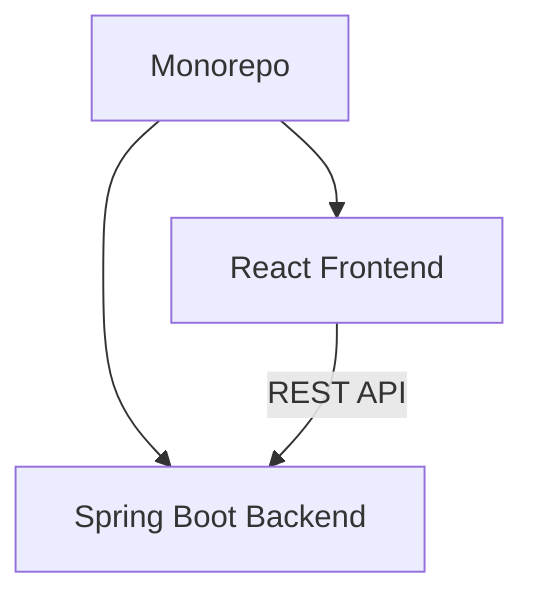
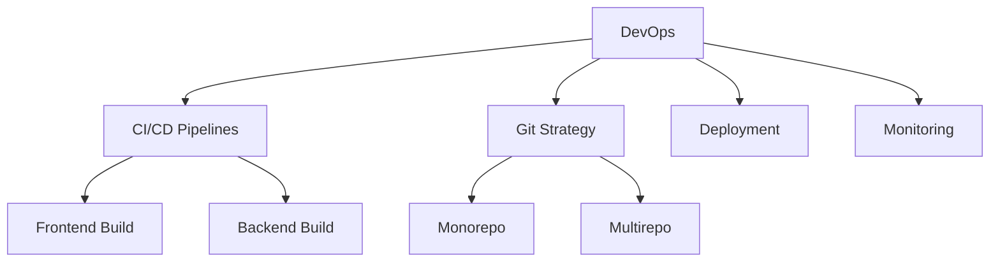

# Architecture Approaches & Git Project Strategies for Fullstack Applications

This document describes different ways to organize **Fullstack** and **Full Architecture** projects,
using modern technologies and Git repository strategies such as **monorepo** and **multirepo**.

---




## 1. Git Repository Strategies

### 1.1 Monorepo
A single Git repository contains all parts of the application.

**Characteristics**
- One repository
- Shared versioning
- Easier synchronization between frontend and backend

**Typical structure**
```
/project-root
  /frontend
  /backend
  /shared
```

**Pros**
- Simplified dependency management
- Easier refactoring across layers
- Single CI/CD pipeline

**Cons**
- Larger repository
- Requires discipline and good folder organization

---

### 1.2 Multirepo
Each part of the system lives in a separate repository.

**Characteristics**
- One repo per project or service
- Independent versioning and deployments

**Typical structure**
```
frontend-repo/
backend-repo/
```

**Pros**
- Clear separation of responsibilities
- Independent scaling and deployments
- Better for large teams

**Cons**
- More coordination needed
- API contracts must be well defined

---

## 2. Architecture Approaches

### 2.1 Fullstack Integrated Application

Frontend and backend are part of the same application.


---
#### Example: Spring Boot + Vaadin
- Backend and UI in the same project
- Server-side rendering
- Ideal for internal tools and rapid development

**Structure**
```
/spring-boot-vaadin
  /src
  /ui
```

---

#### Example: Next.js as Fullstack
- Next.js handles UI and API routes
- Acts as frontend and backend

---

---    

**Structure**
```
/nextjs-app
  /pages
  /api
```

**Use case**
- Lightweight fullstack applications
- Fast prototyping

---

### 2.2 Full Architecture (Decoupled)

Frontend and backend are **separate applications** connected via an API.

#### Example: Spring Boot + React


----
**Architecture**
```
React (Frontend)
   |
REST API
   |
Spring Boot (Backend)
```

**Typical structure (Monorepo)**
```
/full-architecture
  /frontend-react
  /backend-spring-boot
```


**Typical structure (Multirepo)**
```
react-frontend-repo/
spring-boot-backend-repo/
```


---
**Benefits**
- Technology independence
- Scalable and maintainable
- Industry-standard architecture

---

## 3. Choosing the Right Approach

| Scenario | Recommended Approach |
|--------|---------------------|
| Small team, fast delivery | Monorepo + Fullstack |
| Enterprise / large team | Multirepo + Full Architecture |
| Internal tools | Spring Boot + Vaadin |
| Modern web apps | React or Next.js + API |

---

## 4. DevOps Profile and Its Relation to Architecture and Git Strategies

### 4.1 What is a DevOps Profile?

A **DevOps engineer** is responsible for bridging the gap between **development (Dev)** and **operations (Ops)**.
The main goal is to **automate, standardize, and optimize** the software delivery lifecycle.



**Core responsibilities**
- Continuous Integration (CI)
- Continuous Deployment / Delivery (CD)
- Infrastructure as Code (IaC)
- Monitoring and reliability
- Automation and scalability

---

### 4.2 DevOps Responsibilities in Fullstack Architectures

DevOps plays a key role in:
- Designing CI/CD pipelines
- Defining repository strategies
- Managing build and deployment processes
- Environment consistency (dev, staging, production)
- Coordinating frontend and backend releases

---

### 4.3 DevOps and Git Strategies


#### Monorepo
- Single pipeline
- Unified versioning
- Folder-based build optimization

#### Multirepo
- Independent pipelines
- API versioning
- Integration testing between services

---

### 4.4 DevOps and Architecture Types

#### Fullstack Integrated
- Single artifact
- Simple deployment
- Fast pipelines

#### Full Architecture
- Independent deployments
- Separate pipelines
- API gateway and config management

---

## 5. Final Summary

- Architecture defines how systems are built
- Git strategies define how code is managed
- DevOps defines how systems are delivered

Successful projects align **architecture**, **Git strategy**, and **DevOps** from the start.
