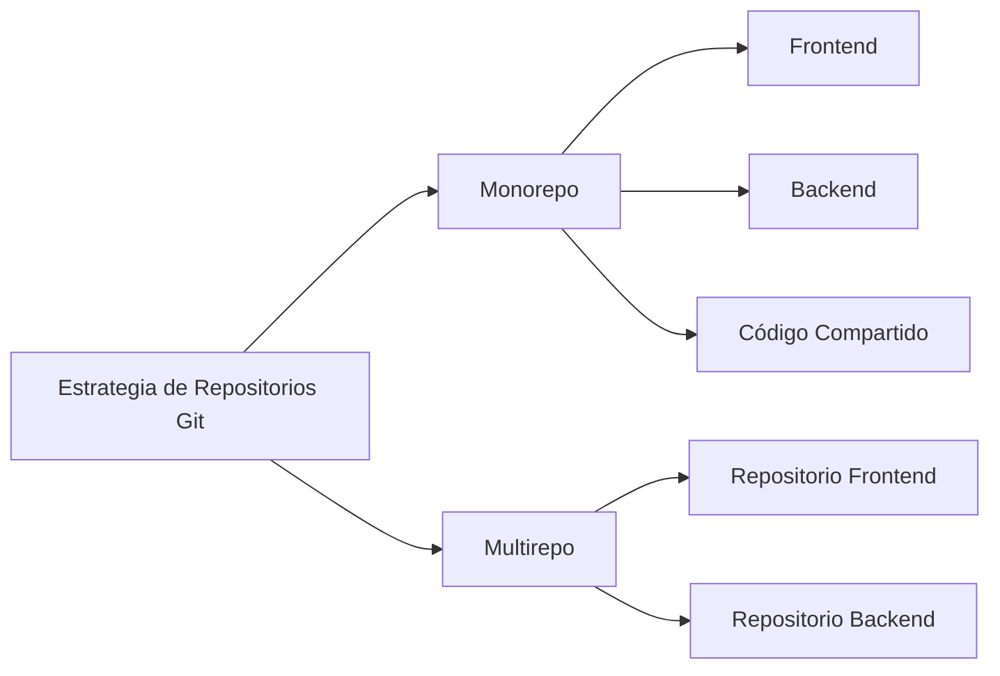
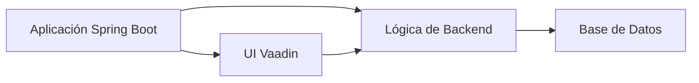
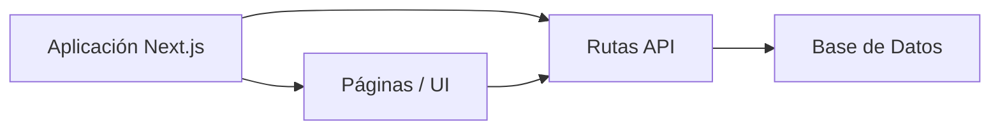
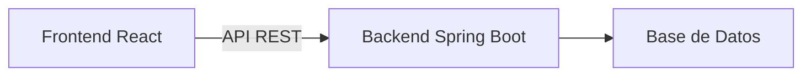
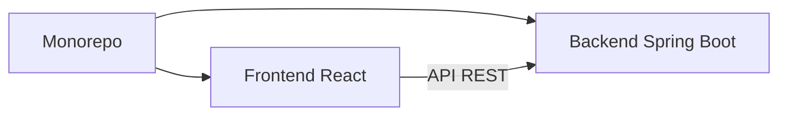
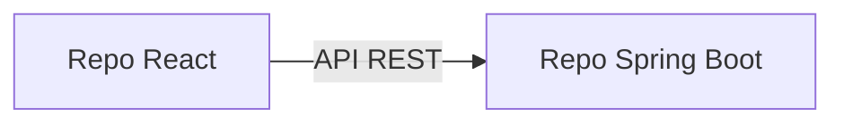
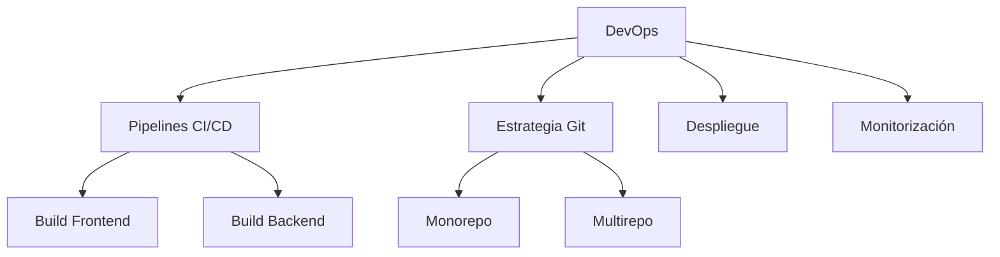

# Enfoques de Arquitectura y Estrategias de Git para Aplicaciones Fullstack

Este documento describe diferentes formas de organizar proyectos **Fullstack** y de **Arquitectura Completa**,
utilizando tecnologías modernas y estrategias de repositorios Git como **monorepo** y **multirepo**.

---


---

## 1. Estrategias de Repositorios Git

### 1.1 Monorepo
Un único repositorio Git contiene todas las partes de la aplicación.

**Características**
- Un solo repositorio
- Versionado compartido
- Sincronización más sencilla entre frontend y backend

**Estructura típica**
```
/project-root
  /frontend
  /backend
  /shared
```

**Ventajas**
- Gestión de dependencias simplificada
- Refactorización más sencilla entre capas
- Un único pipeline de CI/CD

**Desventajas**
- Repositorio más grande
- Requiere disciplina y buena organización de carpetas

---

### 1.2 Multirepo
Cada parte del sistema vive en un repositorio independiente.

**Características**
- Un repositorio por proyecto o servicio
- Versionado y despliegues independientes

**Estructura típica**
```
frontend-repo/
backend-repo/
```

**Ventajas**
- Separación clara de responsabilidades
- Escalado y despliegue independientes
- Más adecuado para equipos grandes

**Desventajas**
- Mayor necesidad de coordinación
- Los contratos de API deben estar bien definidos

---

## 2. Enfoques de Arquitectura

### 2.1 Aplicación Fullstack Integrada

El frontend y el backend forman parte de la misma aplicación.



---

#### Ejemplo: Spring Boot + Vaadin
- Backend y UI en el mismo proyecto
- Renderizado en el servidor
- Ideal para herramientas internas y desarrollo rápido

**Estructura**
```
/spring-boot-vaadin
  /src
  /ui
```

---

#### Ejemplo: Next.js como Fullstack
- Next.js gestiona la UI y las rutas de API
- Actúa como frontend y backend



**Estructura**
```
/nextjs-app
  /pages
  /api
```

**Casos de uso**
- Aplicaciones fullstack ligeras
- Prototipado rápido

---

### 2.2 Arquitectura Completa (Desacoplada)

El frontend y el backend son **aplicaciones separadas** conectadas mediante una API.

#### Ejemplo: Spring Boot + React



**Arquitectura**
```
React (Frontend)
   |
API REST
   |
Spring Boot (Backend)
```

**Estructura típica (Monorepo)**
```
/full-architecture
  /frontend-react
  /backend-spring-boot
```



**Estructura típica (Multirepo)**
```
react-frontend-repo/
spring-boot-backend-repo/
```



**Beneficios**
- Independencia tecnológica
- Escalable y mantenible
- Arquitectura estándar de la industria

---

## 3. Elección del Enfoque Adecuado

| Escenario | Enfoque Recomendado |
|----------|--------------------|
| Equipo pequeño, entrega rápida | Monorepo + Fullstack |
| Empresa / equipo grande | Multirepo + Arquitectura Completa |
| Herramientas internas | Spring Boot + Vaadin |
| Aplicaciones web modernas | React o Next.js + API |

---

## 4. Perfil DevOps y su Relación con la Arquitectura y Git

### 4.1 ¿Qué es un perfil DevOps?

Un **ingeniero DevOps** es responsable de unir **desarrollo (Dev)** y **operaciones (Ops)**.
Su objetivo principal es **automatizar, estandarizar y optimizar** el ciclo de vida del software.



**Responsabilidades principales**
- Integración Continua (CI)
- Despliegue / Entrega Continua (CD)
- Infraestructura como Código (IaC)
- Monitorización y fiabilidad
- Automatización y escalabilidad

---

### 4.2 DevOps en Arquitecturas Fullstack

DevOps juega un papel clave en:
- Diseño de pipelines CI/CD
- Definición de estrategias de repositorio
- Gestión de procesos de build y despliegue
- Consistencia entre entornos (dev, staging, producción)
- Coordinación de despliegues frontend y backend

---

### 4.3 DevOps y Estrategias Git

#### Monorepo
- Pipeline único
- Versionado unificado
- Optimización de builds por carpetas

#### Multirepo
- Pipelines independientes
- Versionado de APIs
- Tests de integración entre servicios

---

### 4.4 DevOps y Tipos de Arquitectura

#### Fullstack Integrado
- Un solo artefacto
- Despliegue simple
- Pipelines rápidos

#### Arquitectura Completa
- Despliegues independientes
- Pipelines separados
- Gestión de API Gateway y configuración

---

## 5. Resumen Final

- La arquitectura define cómo se construyen los sistemas
- Las estrategias Git definen cómo se gestiona el código
- DevOps define cómo se entregan y operan los sistemas

Los proyectos exitosos alinean desde el inicio **arquitectura**, **estrategia Git** y **DevOps**.
