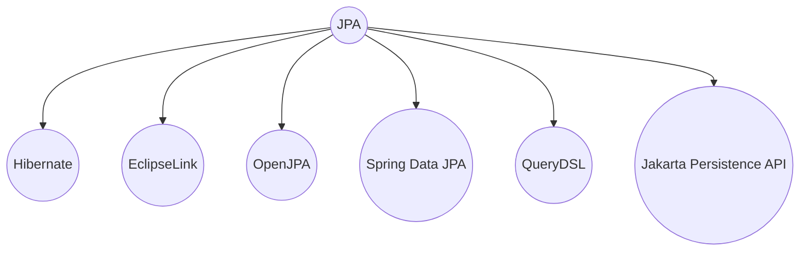
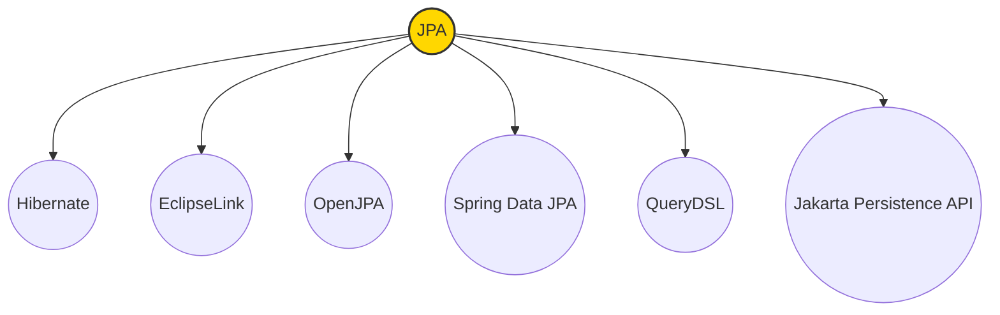
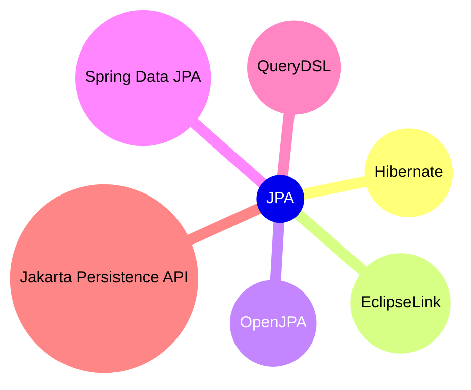

```mermaid
graph TD
    JPA((JPA))
    Hibernate((Hibernate))
    EclipseLink((EclipseLink))
    OpenJPA((OpenJPA))
    SpringDataJPA((Spring Data JPA))
    QueryDSL((QueryDSL))
    JakartaPersistence((Jakarta Persistence API))

    JPA --> Hibernate
    JPA --> EclipseLink
    JPA --> OpenJPA
    JPA --> SpringDataJPA
    JPA --> QueryDSL
    JPA --> JakartaPersistence
```

```mermaid
    graph TD
    style JPA fill:#FFD700,stroke:#333,stroke-width:2px
    JPA((JPA))

    %% Nodos alrededor
    Hibernate((Hibernate))
    EclipseLink((EclipseLink))
    OpenJPA((OpenJPA))
    SpringDataJPA((Spring Data JPA))
    QueryDSL((QueryDSL))
    JakartaPersistence((Jakarta Persistence API))

    %% Conexiones al nodo central
    JPA --> Hibernate
    JPA --> EclipseLink
    JPA --> OpenJPA
    JPA --> SpringDataJPA
    JPA --> QueryDSL
    JPA --> JakartaPersistence
```

```mermaid
mindmap
  root((JPA))
    Hibernate((Hibernate))
    EclipseLink((EclipseLink))
    OpenJPA((OpenJPA))
    SpringDataJPA((Spring Data JPA))
    QueryDSL((QueryDSL))
    JakartaPersistence((Jakarta Persistence API))
```

