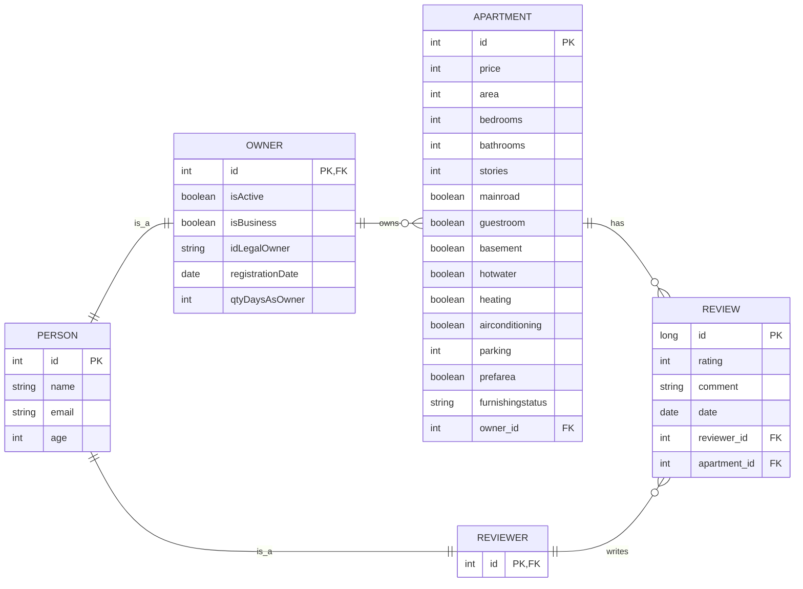

# ER Diagram

## Diagram

### Diagram

```mermaid
erDiagram
    direction LR
    PERSON {
        int id PK ""
        string name  ""
        string email  ""
        int age  ""
    }

    OWNER {
        int id PK,FK ""
        boolean isActive  ""
        boolean isBusiness  ""
        string idLegalOwner  ""
        date registrationDate  ""
        int qtyDaysAsOwner  ""
    }

    REVIEWER {
        int id PK,FK ""
    }

    APARTMENT {
        int id PK ""
        int price  ""
        int area  ""
        int bedrooms  ""
        int bathrooms  ""
        int stories  ""
        boolean mainroad  ""
        boolean guestroom  ""
        boolean basement  ""
        boolean hotwater  ""
        boolean heating  ""
        boolean airconditioning  ""
        int parking  ""
        boolean prefarea  ""
        string furnishingstatus  ""
        int owner_id FK ""
    }

    REVIEW {
        long id PK ""
        int rating  ""
        string comment  ""
        date date  ""
        int reviewer_id FK ""
        int apartment_id FK ""
    }

    PERSON||--||OWNER:"is_a"
    PERSON||--||REVIEWER:"is_a"
    OWNER||--o{APARTMENT:"owns"
    APARTMENT||--o{REVIEW:"has"
    REVIEWER||--o{REVIEW:"writes"
```