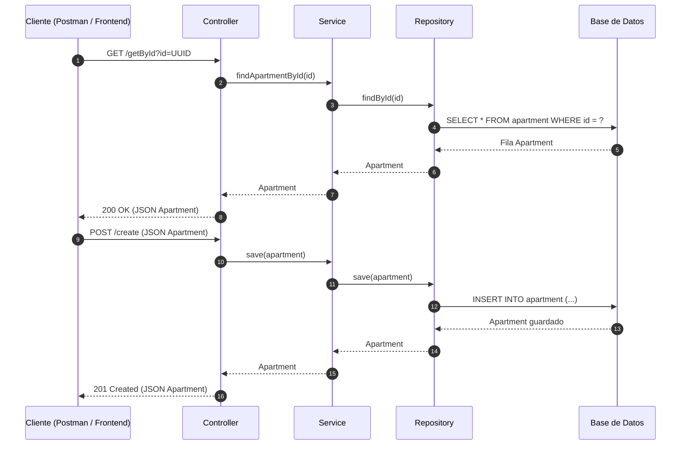

# 📑 Technical Documentation: Request-Response Cycle (Java Spring Boot)

This document explains how data flows through the application layers, dissecting the specific code for the `Apartment` project to define exactly what each line does.


---




---

## 1. The Data Model (Entity Layer)
The `Apartment` class is the blueprint for our data. It defines the structure that will be stored in the DB and returned as a JSON response.

### `Apartment.java`
```java
@Entity // Tells JPA/Hibernate that this class maps to a database table.
public class Apartment {

    @Id // Defines the Primary Key for the database.
    protected String id;

    // ... other fields like price, area, bedrooms ...

    // Default Constructor
    public Apartment() {
        // LINE ANALYSIS: Every time a new object is created, a unique ID is generated.
        // This is the starting point for the 'Create' cycle.
        this.id = UUID.randomUUID().toString(); 
    }
}
```

---

## 2. GET Cycle: Find Apartment by ID
This cycle focuses on retrieving existing data using a specific parameter.

### A. Controller Layer (The Entry Point)
```java
@GetMapping("/getById") // Defines the HTTP GET endpoint.
public Apartment getApartmentById(@RequestParam String id){
    // INPUT (Parameter): '@RequestParam String id' captures the ID from the URL (e.g., ?id=123).
    // ACTION: Calls the service layer passing the ID.
    // OUTPUT (Return): The Apartment object returned by the service is sent to Postman as JSON.
    return apartmentService.findApartmentById(id);
}
```

### B. Service Layer (The Business Logic)
```java
public Apartment findApartmentById(String id) {
    // INPUT: Receives the 'id' String from the controller.
    // ACTION: Queries the repository. '.orElse(null)' handles the "not found" case.
    // OUTPUT (Return): Returns the found Apartment object or null.
    return apartmentRepository.findById(id).orElse(null);
}
```

### C. Repository Layer (The Data Access)
```java
public interface ApartmentRepository extends CrudRepository<Apartment, String> {
    // ACTION: Extends CrudRepository to inherit the logic for
    // "SELECT * FROM Apartment WHERE id = ?".
}
```

---

## 3. POST Cycle: Create New Apartment
This cycle involves sending new data to be persisted in the Database.

**Step-by-Step Breakdown:**
1. **Request:** The user sends a JSON body via Postman to the `/create` endpoint.
2. **Controller:** Captures the JSON and converts it into an `Apartment` object.
3. **Service:** Receives the object and triggers the `save()` method.
4. **Repository:** Executes an `INSERT` SQL command.

---

## 4. Summary Table: Inputs vs. Outputs

| Layer       | Method    | Input                         | Output                         |
|-------------|-----------|-------------------------------|--------------------------------|
| Controller  | getById   | String id (URL Param)         | Apartment Object (JSON)        |
| Service     | findAll   | None                          | Iterable<Apartment>            |
| Service     | findById  | String id                    | Apartment Object               |
| Repository  | save      | Apartment Entity              | Apartment (Stored in DB)       |

---

## 5. Demonstration in Postman

### GET Request Example
**Method:** GET  
**URL:**  
```
http://localhost:8080/getById?id=your-uuid-here
```

**Response (200 OK):**
```json
{
    "id": "86da7c7b-3b0d-4f36-a36c-974a6f233f20",
    "price": 450000,
    "area": 120,
    "bedrooms": 3,
    "reviews": []
}
```

### POST Request Example
**Method:** POST  

**Body (JSON):**
```json
{
    "price": 320000,
    "area": 95,
    "bedrooms": 2,
    "bathrooms": 1
}
```

**Response:**  
The server returns the created object including the generated `id`.


---
  [⬅️ Back to Index](../README.md#table-of-contents)