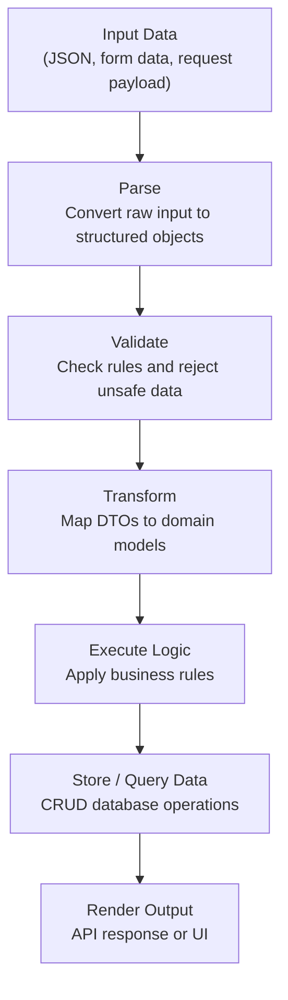

# Software Data Flow, Architecture, and Runtime – Unified Cheat Sheet

## 1. End-to-End Mental Model

---

## 2. Core Terminology by Domain

### Data Flow & Transformation
- **Parse**: Convert raw input into structured representations.
- **Map / Transform**: Convert data between shapes (DTOs, domain models).
- **Serialize / Deserialize**: Objects ⇄ bytes/strings (JSON, XML).
- **Validate / Sanitize**: Enforce rules and remove unsafe content.
- **Encode / Decode**: Change representation (URL, Base64, JWT).

### Requests, Persistence & Messaging
- **Query**: Read/filter data from storage or search engines.
- **Fetch / Request**: Retrieve data over protocols (HTTP, gRPC).
- **CRUD**: Create, Read, Update, Delete.
- **Persist / Store / Cache**: Durable vs temporary storage.
- **Publish / Subscribe / Enqueue / Dispatch**: Messaging and event handling.

### Code, Build & Runtime
- **Compile / Transpile**: Convert source to another form.
- **Bundle / Minify / Optimize**: Prepare assets for delivery.
- **Execute / Invoke / Call**: Run code.
- **Hook / Intercept**: Attach lifecycle logic.
- **Instrument / Profile / Monitor**: Measure and observe behavior.

### UI, UX & Client Behavior
- **Render**: Turn state into UI.
- **Mount / Unmount**: Attach or detach components.
- **Hydrate**: Add client behavior to server-rendered HTML.
- **Animate / Transition**: Visual state changes.
- **Handle / Dispatch Events**: Process user/system actions.

### Security, Access & Control
- **Authenticate / Authorize**: Identity and permissions.
- **Encrypt / Decrypt / Sign / Verify**: Data protection.
- **Hash**: Fixed-length digests.
- **Throttle / Rate-Limit**: Control request frequency.
- **Escape / Filter**: Prevent injection and XSS.

---

## 3. Stack Mappings

### Java / Spring Boot
- Parse: `@RequestBody`, Jackson
- Validate: `@Valid`
- Transform: MapStruct
- Persist: JPA/Hibernate
- Publish: Spring Events, Kafka
- Secure: Spring Security
- Monitor: Micrometer

### Node.js / NestJS
- Parse: `express.json()`
- Validate: Zod, Joi
- Transform: DTOs
- Persist: Prisma, TypeORM
- Publish: BullMQ, Kafka
- Secure: JWT, Passport
- Monitor: OpenTelemetry

### React / Next.js
- Render: JSX
- Mount/Unmount: `useEffect`
- Hydrate: `hydrateRoot`
- Fetch: `fetch`, React Query
- Cache: Client cache

### .NET / ASP.NET Core
- Parse: Model binding
- Validate: DataAnnotations
- Transform: AutoMapper
- Persist: EF Core
- Publish: MediatR
- Secure: ASP.NET Identity

---

## 4. Interview-Level Distinctions

- **Parse vs Deserialize**: Structure vs object instantiation.
- **Encode vs Encrypt**: Representation vs secrecy.
- **Validate vs Sanitize**: Correctness vs safety.
- **Cache vs Persist**: Temporary vs durable.
- **Publish vs Dispatch**: Broadcast vs targeted.
- **Hydration**: Attach JS to server-rendered HTML.

---

## 5. Architecture Checklist

### Input
- Parsed safely
- Validated
- Sanitized

### Business Logic
- Clean domain models
- Deterministic transformations

### Persistence
- Optimized queries
- Caching strategy
- Transactions

### Messaging
- Clear event contracts
- Idempotent consumers
- Retries and DLQs

### API / UI
- Stable serialization
- Versioning
- Consistent errors

### Security
- AuthN/AuthZ
- Rate limiting
- Encryption

### Observability
- Logs
- Metrics
- Traces

---

## 6. Usage

Use this document as:
- A system design reference
- Interview prep material
- Architecture review checklist
- Teaching and onboarding guide
