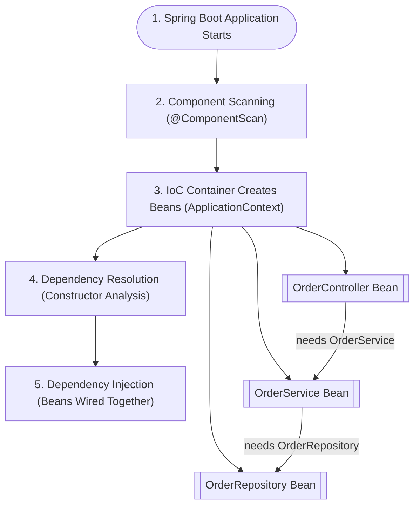

# Spring Boot – IoC & DI Flow Diagram

## Explanation

### 1. Spring Boot Application Starts
Spring Boot initializes the IoC container.

### 2. Component Scanning
Spring detects classes annotated with `@Controller`, `@Service`, `@Repository`, and `@Component`.

### 3. IoC Container Creates Beans
Spring instantiates and manages these components as beans.

### 4. Dependency Resolution
Spring reads constructor parameters to determine dependencies.

### 5. Dependency Injection
Spring injects the required beans into each component automatically.
