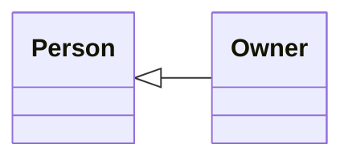
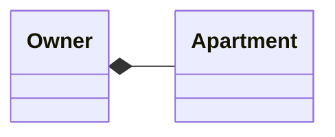
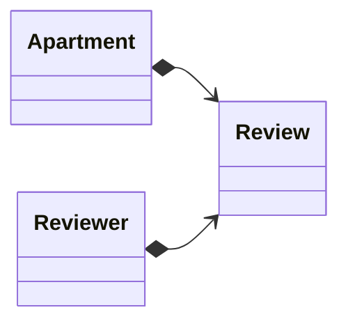
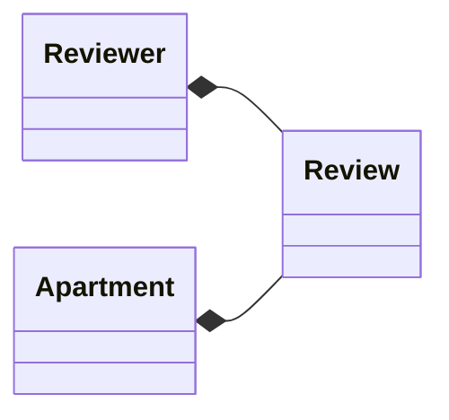
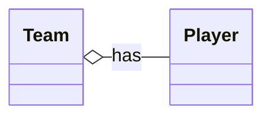
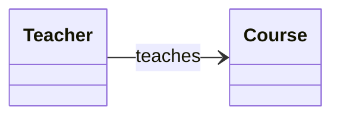

# UML Relationships Explained (Applied to the ApartementPrediction Model)

[⬅️ Back to Index](../README.md#table-of-contents)

```mermaid
classDiagram
direction LR
    class Person {
	    - int id
	    - String name
	    - String email
	    - int age
    }

    class Owner {
	    - boolean isActive
	    - boolean isBusiness
	    - String idLegalOwner
	    - LocalDate registrationDate
	    - int qtyDaysAsOwner
	    - List~Apartment~ apartments
	    + addApartment(Apartment)
    }

    class Reviewer {
	    - List~Review~ reviews
	    + addReview(Review)
    }

    class Apartment {
	    - int id
	    - Integer price
	    - Integer area
	    - Integer bedrooms
	    - Integer bathrooms
	    - Integer stories
	    - boolean mainroad
	    - boolean guestroom
	    - boolean basement
	    - boolean hotwater
	    - boolean heating
	    - boolean airconditioning
	    - byte parking
	    - boolean prefarea
	    - String furnishingstatus
	    - Owner owner
	    - List~Review~ reviews
	    + addReview(Review)
    }

    class Review {
	    - Long id
	    - int rating
	    - String comment
	    - LocalDate date
	    - Reviewer reviewer
	    - Apartment apartment
    }

	<<abstract>> Person

    Person <|-- Owner
    Person <|-- Reviewer
    Owner "1" *-- "0..*" Apartment : owns
    Apartment "1" *--> "n" Review : has
    Reviewer "1" *--> "0..*" Review : writes
    Review "1" --* "1" Reviewer : reviewer
    Review "1" --* "1" Apartment : apartment
   ``` 


## 1️⃣ Inheritance `<|--`

Inheritance represents an "is-a" relationship.

### In your UML:

    Person <|-- Owner
    Person <|-- Reviewer

### Meaning

Owner and Reviewer are specialized types of Person.

### Code Example

``` java
public abstract class Person {
    int id;
    String name;
    String email;
    int age;
}

public class Owner extends Person {
    boolean isActive;
}

public class Reviewer extends Person {
    List<Review> reviews;
}
```



------------------------------------------------------------------------

## 2️⃣ Composition `*--`

Composition represents strong ownership (lifecycle dependency).

### In your UML:

    Owner "1" *-- "0..*" Apartment : owns

### Meaning

An Owner owns the Apartments. If Owner is removed, Apartments lose
meaning.

### Code Example

``` java
public class Owner extends Person {
    private List<Apartment> apartments = new ArrayList<>();
}
```



------------------------------------------------------------------------

## 3️⃣ Directed Composition `*-->`

A stronger dependency where an object contains another.

### In your UML:

    Apartment "1" *--> "n" Review : has
    Reviewer "1" *--> "0..*" Review : writes

### Meaning

Both Apartment and Reviewer own Reviews.

### Code Example

``` java
public class Apartment {
    private List<Review> reviews = new ArrayList<>();
}

public class Reviewer {
    private List<Review> reviews = new ArrayList<>();
}
```


------------------------------------------------------------------------

## 4️⃣ Reverse Composition `--*`

Indicates a strong dependency from the child to its parent.

### In your UML:

    Review "1" --* "1" Reviewer : reviewer
    Review "1" --* "1" Apartment : apartment

### Meaning

Reviews do not exist without a Reviewer and an Apartment.

### Code Example

``` java
public class Review {
    private Reviewer reviewer;
    private Apartment apartment;
}
```


------------------------------------------------------------------------

------------------------------------------------------------------------

## 4️⃣ Aggregation `o--`

A weak "has a" relationship.\
The part **can exist independently** of the whole.

**Example:**\
- `Team o-- Player`\
  Players exist even if the team is disbanded.


**Usage:**\
Use aggregation when a class *contains* or *manages* other objects, but
does not "own" them.


### In your UML:

    -   There is not an Aggregation relationship in this UML

### Meaning

    -   No meaning

### Code Example

``` java
public class {
    private 
    private 
}
```

------------------------------------------------------------------------


## 4️⃣ Association `-->`

A general relationship between two classes.\
Describes interaction, communication, or a simple reference.

**Example:**\
- `Teacher --> Course`\
  A teacher teaches a course.



**Usage:**\
Use association for most general relationships that don't imply
ownership or dependence.


### In your UML:

    -   There is not an Aggregation relationship in this UML

### Meaning

    -   No meaning

### Code Example

``` java
public class {
    private 
    private 
}
```

------------------------------------------------------------------------

# Summary Table

  -----------------------------------------------------------------------------
  Symbol   Name          Dependency   Description           Example Meaning
  -------- ------------- ------------ --------------------- -------------------
  `<|--`   Inheritance   No           "Is a type of"        Dog ← Labrador

  `*--`    Composition   Yes          Strong ownership      House → Rooms

  `o--`    Aggregation   No           Weak containment      Team → Players

  `-->`    Association   No           General relationship  Teacher → Course
  -----------------------------------------------------------------------------

------------------------------------------------------------------------

# Full Interpretation of Your UML

Your domain model uses: - Inheritance for Person hierarchy - Composition
for Apartments owned by Owners - Directed composition for Reviews -
Strong dependency of Review → (Reviewer + Apartment)

This ensures no orphan objects and a clean domain structure.
